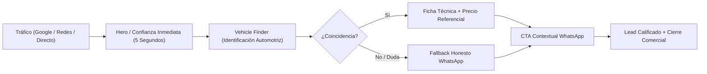

# LIDERPRO DIGITAL — CONVERSION RATE OPTIMIZATION & UX AUDIT (V5.0)
**Fecha:** 2026-10-07  
**Estado:** APROBADO (Embudo WhatsApp Commerce de Alta Fricción Reducida)  
**Objetivo:** Maximizar el flujo Tráfico → Confianza → Vehículo → Compatibilidad → WhatsApp → Venta.

---

## 1. Arquitectura del Embudo de Conversión

El modelo de conversión de LiderPro Digital reconoce la realidad del mercado automotriz en Ecuador: los compradores rara vez completan un checkout con tarjeta de crédito sin confirmar antes si el borne es derecho/izquierdo, si el aceite cumple la especificación de su fabricante o si hay servicio de instalación a domicilio.

Por ello, la interfaz actúa como un **filtro y catalizador de alta confianza** para derivar tráfico cualificado hacia WhatsApp:

---

## 2. Puntos Críticos de Fricción Resueltos

### 2.1 Tiempo de Comprensión del Hero (< 5 segundos)
- **Problema previo:** Textos extensos explicaban la historia de la empresa antes de ofrecer la solución.
- **Optimización V5.0:**
  - Título directo: *"Tu vehículo. Nuestra experiencia."*
  - Mensaje claro: *"Encuentra el producto adecuado para tu vehículo, recibe asesoría especializada y cómpralo con confianza."*
  - Opciones primarias evidentes: Buscador de productos o Asesor directo.

### 2.2 Vehicle Finder como Motor de Interacción
- **Problema previo:** Formularios intimidantes con jerga mecánica que alejaban al usuario novato.
- **Optimización V5.0:**
  - Micro-copy de alivio cognitivo: *"No necesitas saber de mecánica. Nosotros te ayudamos a encontrar el producto exacto."*
  - Cascada lógica: Selección de Marca filtra Modelos, que a su vez habilita Años y Motores.
  - Alivio para casos inciertos: Enlace persistente "¿No estás seguro de los datos de tu auto? Habla con un asesor".

### 2.3 Mensajería de WhatsApp Pre-Estructurada
- **Problema previo:** Enlaces de WhatsApp que abrían un chat vacío o un mensaje genérico ("Hola").
- **Optimización V5.0:**
  - Enlaces contextuales con parámetros url-encoded (`whatsapp.ts`):
    - **Consulta de Producto:** Incluye SKU, Nombre y compatibilidad de vehículo si fue buscado previamente.
    - **Emergencia de Batería:** Pre-carga mensaje de urgencia con solicitud de ubicación y foto.
    - **Consulta de Sucursal:** Pre-carga interés específico en Pedernales o Quito.
    - **Cotización para Flotas:** Formato B2B para pedidos por volumen.

### 2.4 Mobile Commerce Experience
- **Problema previo:** En pantallas móviles, el usuario debía hacer scroll infinito para encontrar los botones de contacto.
- **Optimización V5.0:**
  - Barra fija inferior (Sticky Bar): Contiene 2 botones táctiles de 48px de altura:
    1. `Buscar Producto` (ancla directa al Vehicle Finder).
    2. `Asesor` (enlace con icono directo a WhatsApp).
  - Todos los botones y selectores cumplen con el tamaño táctil mínimo de 44-48px para evitar "fat-finger errors".

---

## 3. Matriz de Heurísticas de Usabilidad y Conversión

| Heurística | Estado V5.0 | Detalle |
| :--- | :---: | :--- |
| **Claridad de Valor** | Excelente | La propuesta de valor responde "qué hago aquí" en menos de 3 segundos. |
| **Prevención de Errores** | Excelente | Selectores dependientes evitan seleccionar años incompatibles con modelos. |
| **Transparencia en Precios** | Excelente | Precios referenciales claros sin letras chicas engañosas. |
| **Rigor de Confianza** | Excelente | Disclaimers reales en garantías y tiempos de entrega. |
| **Velocidad de Carga** | Excelente | Páginas 100% pre-renderizadas estáticamente (SSG / Next.js). |
| **Accesibilidad Táctil** | Excelente | Objetos interactivos con espaciado amplio y contraste cromático WCAG AA. |

---

## 4. Conclusión CRO
LiderPro Digital V5.0 maximiza la tasa de conversión transformando visitantes pasivos en conversaciones activas de WhatsApp de alta intención de compra.
